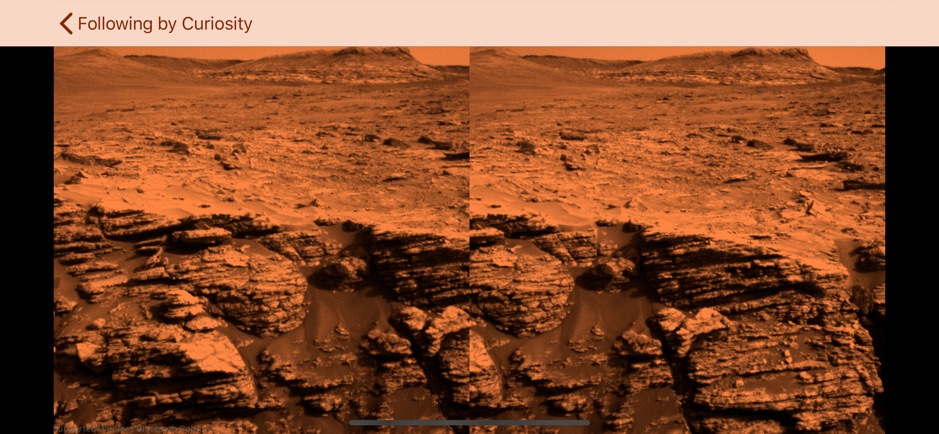

# MarsViewBee

https://apps.apple.com/us/app/marsviewbee/id1474997686?ls=1

Application collect raw stereo images from Curiosity rover sol by sol. Displays in VR using fake colors (as raw images are black and white). 
Support Bluetooth control to easily navigate trough the daily images, while VR head set stays on the head.

Please contact if you experience any issue using this app.

Developed by: Andrii Pervushyn

Contact email: andrei.perwushin@gmail.com
